# 5G Trace Visualizer

* Table of contents
  * [Summary](#summary)
  * [Requirements](#requirements)
  * [Application structure](#application-structure)
  * [Plotting Scripts](#plotting-scripts)
    * [Parsing Spirent Result Files](#parsing-spirent-result-files)
    * [Plotting 5GC messages](#plotting-5gc-messages)
    * [Plotting 5GC messages and k8s load](#plotting-5gc-messages-and-k8s-load)
    * [Plotting User Plane latency](#plotting-user-plane-latency)
    * [Comparing User Plane latency](#comparing-user-plane-latency)
    * [Procedure Time](#procedure-time)
  * [Examples](#examples)
    * [Help](#help)
    * [Wireshark Portable](#wireshark-portable)
    * [5GC Trace](#5gc-trace)
    * [HTTP/2 trace](#http2-trace)
    * [Adding pod data](#adding-pod-data)
    * [Merging capture files](#merging-capture-files)
    * [Specifying HTTP/2 ports](#specifying-http2-ports)
    * [Using several Wireshark versions for decoding](#using-several-wireshark-versions-for-decoding)
    * [Omitting HTTP/2 headers](#omitting-http2-headers)
    * [Adding additional host labels](#adding-additional-host-labels)
    * [Adding timestamps](#adding-timestamps)
    * [Showing only certain packets](#showing-only-certain-packets)
    * [Sharing an edited trace](#sharing-an-edited-trace)
    * [Ordering labels in a specific order](#ordering-labels-in-a-specific-order)
    * [Missing HTTP headers and HPACK](#missing-http-headers-and-hpack)
    * [Proprietary protocol traces](#proprietary-protocol-traces)
# Summary

This set of Python scripts allow you to convert ``pcap``, ``pcapng`` or ``pdml`` 5G protocol traces ([Wireshark](https://www.wireshark.org/), [tcpdump](https://www.tcpdump.org/), ...) into SVG sequence diagrams.

It was born from the need to automatically convert 5G traces into something readable given that we needed to account for:
* Mix of HTTP/2, 5G-NAS and PFCP protocols for 5G trace_visualizer
* Additionally, GTP/GTP', Diameter when testing 4G/5G interoperability
* Sequence details are quite tiring to check in the Wireshark GUI
* Specific versions of Wireshark may be needed to decode specific versions of (e.g.) 5G-NAS
* The shift to containers results into traces with multiple IP addresses that are dynamically allocated by k8s
* Mapping of IPs to container names in the deployment, including [Calico](https://www.projectcalico.org/) and [Multus](https://github.com/intel/multus-cni) interfaces
* In some cases, what is of interest are the exchanges between namespaces and not between containers
* Mapping of IPs to VM names in the deployment
* Different coloring of the different 5G protocols (NAS, HTTP/2, PFCP, ...), as well as differentiating between requests and responses where possible

We could not find a commercial tool doing exactly what we needed. While [PlantUML](http://plantuml.com/) can generate nice diagrams, doing those manually requires too much time. So we resorted to putting together this script.

## Requirements
* You need to have Java installed (executing the ``java`` command must launch Java). This is required because PlantUML runs on Java
* ``plantuml.jar`` must be placed in the base directory (see [``place plantuml.jar here.txt``](place plantuml.jar here.txt)). This application was tested with the 2019.11 version (Apache Software License Version) of ``plantuml.jar``. You can find it [here](http://sourceforge.net/projects/plantuml/files/plantuml-jar-asl-1.2019.12.zip/download).
* Wireshark portable of the desired versions placed in the ``/wireshark`` folder. See [instructions in folder](/wireshark/Readme.md).

### Installation process for Linux
0. clone the repo
1. download and extract ``plantuml.jar`` in the base directory.
2. ``sudo apt -y install wireshark tshark``
3. ``sudo apt -y install default-jre python3-pip``
4. ``sudo pip3 install --upgrade pyyaml packaging``

example run command - ``python3 trace_visualizer.py -wireshark "OS" ./doc/free5gc.pcap``

## Application structure

The figure below summarizes what this small application does ([SVG](doc/summary.svg), [PNG](doc/summary.png), [Mermaid](doc/summary.mermaid))


## Plotting Scripts

You will notice several ``plotting_xxx.ipynb`` files.

These are [iPython](https://ipython.org/) scripts that make use of the implemented functionality to generate nice, interactive plots vbased on
data from 5G traces.

In order to run the scripts you will need:
* [Jupyter Lab](https://jupyter.org/) (I use [Anaconda](https://www.anaconda.com/) and that is what I will assume was 
  installed for the sake of documentation)
* Install NodeJS: ``conda install nodejs``.
* [Plotly](https://plotly.com/): used for plotting. In order to install it, you can follow the instructions 
  [here](https://plotly.com/python/getting-started/#jupyterlab-support).
  
Since these scripts rely on parsing of 3rd party outputs, no assurance is given that these are up-to-date. You should
consider them as just examples how you could accomplish such visualization(s).
  
The following scripts are included:

### Parsing Spirent Result Files

File: [``plotting_parsing_spirent.ipynb``](plotting_parsing_spirent.ipynb)

For those of you using Spirent for testing, you may need to quickly compare certain parameters 
(e.g. ``Basic Data Message One Way Trip Delay (micro-sec)``).

The way Spirent stores test results is by means of an Excel file named ``<date>_RID-<test number>__<test name>.xls``.
You can use this script to scan a folder containing such Excel files and load data from each of them in a table you can
use for comparing test runs.

Currently, the script only imports parameters from the ``L5-7 Client|Basic`` worksheet but can be easily extended.
An example is provided to plot a comparison bar chart of the one-way delay for each test.

For obvious reasons, no example files are provided.

### Plotting 5GC messages

File: [``plotting_pcap.ipynb``](plotting_pcap.ipynb)

This cript provides some functionality to convert packet traces to 
[DataFrame](https://pandas.pydata.org/pandas-docs/stable/reference/api/pandas.DataFrame.html) format and to plot the 
resulting data using [plotly](https://plotly.com/python/).

This script can be used to plot a 5GC packet capture on a time axis. 
Do note that we are just plotting the first ``plot_data`` element (you can trace multiple capture files simultanously).
The color bars use the same protocol color code as the sequence diagram.

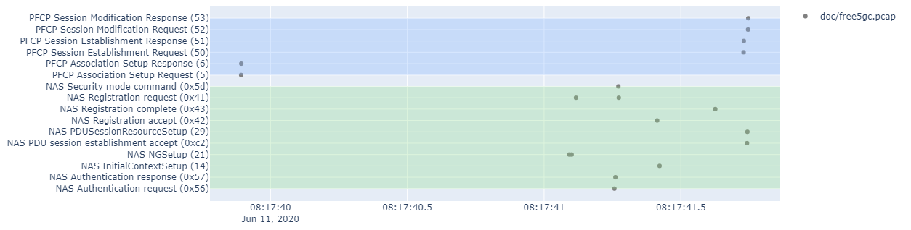 

More interactive HTML version available [here](doc/free5gc_pcap_plot.html).

### Plotting 5GC messages and k8s load

File: [``plotting_k8s_metrics.ipynb``](plotting_k8s_metrics.ipynb)

This script shows a more complex use case where k8s KPIs and packet traces can be plotted on a common time axis 
(no example raw data provided for this case). The end result would look as shown below:

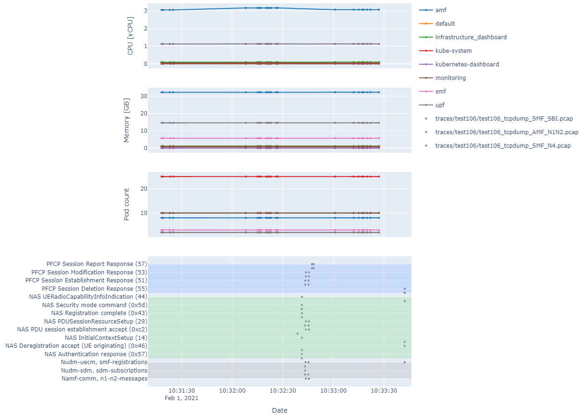

In the case of the k8s KPIs, the data needs to be in the format output by ``kubectl get --raw /apis/metrics.k8s.io/v1beta1/pods/`` per line.

### Plotting User Plane latency

File: [``plotting_latency_analysis.ipynb``](plotting_latency_analysis.ipynb)

Given:
  * A test case where UDP or ICMP packets are transmitted between UE and DN
  * That each generated packet has a unique data payload
  * A packet trace of N3 packets (GTP-U)
  * A packet trace of N6 packets
  * That the hosts doing each capture are time-synchronized (or are the same host)
  * This is usually the case if you use commonly-used test tools to test User Plane (UP)

This script calculated the one-way delay for each single packet and plots a normalized histogram (i.e. a distribution)
of the packet latency.

The packet parsing does not use the [lxml](https://lxml.de/) library for parsing because it proved to be too resource-intensive
to parse the whole PDML file just to get the payloads, so a custom XML parser is used instead. for ca. 90k packets, each
trace took around 2 minutes on an i7 laptop without needing too much memory.

To enable re-use of the parsed data without having to parse again the ``pcap`` files, the parsed data is stored in
[``pickle``](https://docs.python.org/3/library/pickle.html) format and compressed with 
[``bz2``](https://docs.python.org/3/library/bz2.html).

Result based on the example data included ([N3 capture](doc/n3_example.pcap), [N6 capture](doc/n6_example.pcap)):

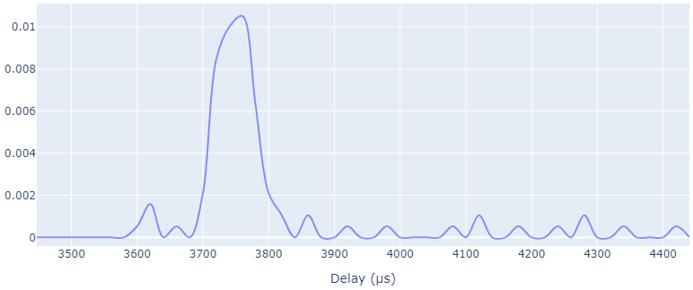

Resulting (compressed) Pickle file: [UP_example_analysis.pbz2](doc/UP_example_analysis.pbz2)

### Comparing User Plane latency

File: [``plotting_latency_compare.ipynb``](plotting_latency_compare.ipynb)

Used for comparing latency data of several analyzed user plane captures. Separated from the parsing script so as to avoid
re-parsing every time.

Result based on the example data included 
(based on importing [UP_example_analysis.pbz2](doc/UP_example_analysis.pbz2) and [UP_example_analysis_2.pbz2](doc/UP_example_analysis_2.pbz2)):

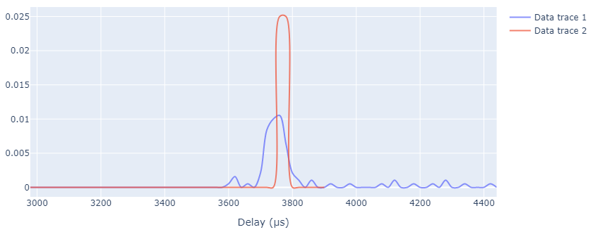

HTML version (interactive): [latency_comparison.html](doc/latency_comparison.html)

### Procedure Time

File: [``plotting_procedure_time.ipynb``](plotting_procedure_time.ipynb)

Takes as input a CP trace and plots procedure duration:
  * Distribution of procedure time
    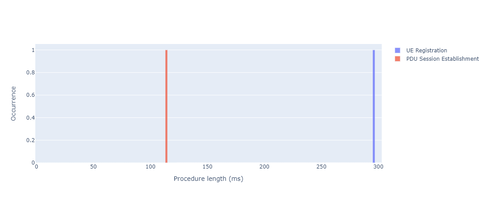
    [HTML version](doc/free5gc_procedure_length.html)
  * Occurrence over time
    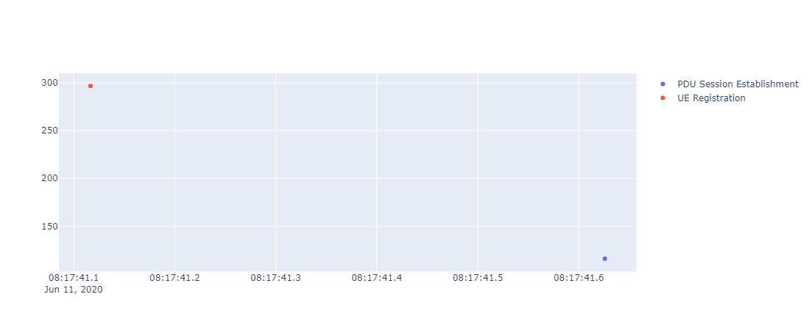
    [HTML version](doc/free5gc_procedure_timeline.html)
    
Note: a limited set of procedures are supported for now. More may be supported over time.

## Examples

### Help

Run ``python trace_visualizer.py --help`` for a list of all available parameters, default values and other things you may need.

### Wireshark Portable

The ``-wireshark`` option lets you use a specific Wireshark version. The way this works is by using this parameter to generate the path for the ``tshark`` and ,if more than one trace is specified, ``mergecap``, call. It is a scripted command, nothing more:
* ``OS``: no absolute path for ``tshark`` is generated. That is, the ``tshark`` from the OS's path will be used
* ``<version number>``: an absolute path location for the ``tshark`` executable is generated. The executable is assumed to be located in the following location: ``wireshark/WiresharkPortable_<version number>``.
* ``latest``: similar to the previous option, this option scans the ``wireshark`` folder and out of all of the found folders chooses the one with the highest version number. 

Example: [WiresharkPortable version 3.4.4](https://1.eu.dl.wireshark.org/win32/WiresharkPortable_3.4.4.paf.exe) should be placed in a directory named ``WiresharkPortable_3.4.4``.

Do note that "Wireshark Portable" applies to Windows only. In Linux, the same concept applies. Just make sure that the script can find ``tshark`` and ``mergecap`` where it expects to. That is:
* ``tshark``: ``wireshark/WiresharkPortable_<version number>/App/Wireshark/tshark``
* ``mergecap``: ``wireshark/WiresharkPortable_<version number>/App/Wireshark/mergecap``

Note: whether symlinks work is not tested.

### 5GC trace

Many, many thanks to the [free5GC project](https://www.free5gc.org/) for providing some 5GC traces we could use to show some examples on how to use the application.


The free5GC is an open-source project for 5th generation (5G) mobile core networks. The ultimate goal of this project is to implement the 5G core network (5GC) defined in 3GPP Release 15 (R15) and beyond.

Please be sure to visit their project website [free5GC](https://www.free5gc.org/) and their [Github repository](https://github.com/free5gc/free5gc).

They provided us with [the following trace](doc/free5gc.pcap), which we will use to illustrate the examples.

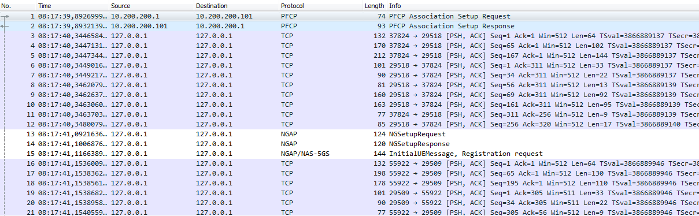

### HTTP/2 trace

While this tool was born with 5GC traces in mind, it turns out to be useful at visualizing HTTP/2 traces. We had this HTTP/2 example because at the beginning we could not find any freely available 5GC traces (they typically contain intra-NF communication and/or proprietary protocol specifics, so they are not easy to come by).

As alternative, we will use the sample HTTP/2 capture from the [Wireshark wiki](https://wiki.wireshark.org/HTTP2) and show you how to use the application with the [``http2-h2c.pcap``](https://wiki.wireshark.org/HTTP2?action=AttachFile&do=get&target=http2-h2c.pcap) file

As shown in Wireshark, the capture should look as shown below:


The following command converts the Wireshark trace into the SVG diagram shown below give that ``plantuml.jar`` and the ``WiresharkPortable_3.1.0`` folder are placed where they should:

``python trace_visualizer.py -wireshark "3.1.0" "<file path>\Sample of HTTP2.pcap"``


([Link to SVG file](doc/Sample%20of%20HTTP2.svg))

### Adding pod data

Sometimes you would like to group several diagram actors into one (e.g. a pod with multiple calico interfaces) or several pods belonging to one namespace (e.g. belonging to the same NF).

Just use the ``-pods`` optional parameter and as parameter use the output of ``kubectl get pods --all-namespaces -o yaml``

e.g. ``python trace_visualizer.py -pods "<path to YAML file>" -wireshark "3.1.0" "<file path>\Sample of HTTP2.pcap"``

The script will now output a ``pod`` and ``namespace`` version of the SVGs, where the IPs will be replaced with pod names or namespace names respectively.

This allows you to message flows between pods and/or namespaces to have a clearer view of the messaging.

The application currently maps following information found in the ``kubectl`` YAML file:
* ``namespace`` association within the ``metadata`` elements
* IP addresses associated to this pod:
  * ``cni.projectcalico.org/podIP`` within the ``annotations`` ``metadata`` element
  *  ``ips`` elements within the JSON data within ``k8s.v1.cni.cncf.io/networks-status``

The name assigned to the pod is that found under the ``name`` element.

In case you only want to generate specific diagram types, you can use ``-diagrams <diagram types>`` option, e.g. ``-diagrams "ip,k8s_pod,k8s_namespace"``. Supported diagram types:
* ``ip``: does not use k8s pod information for diagram generation
* ``k8s_pod``: generates diagrams where IPs are replaced by pod names and intra-pod communication (e.g. different [Multus](https://github.com/intel/multus-cni) interfaces in a pod) are not shown
* ``k8s_namespace``: similar to ``k8s_pod`` but messages are grouped by namespace

### Merging capture files

You may also input not a single capture as input, but a comma-separated list of capture files. In this case, the script will automatically call [``mergecap``](https://www.wireshark.org/docs/man-pages/mergecap.html) and merge the given capture files. This can be useful if you have capture files from e.g. several k8s worker nodes.

``python trace_visualizer.py -wireshark "3.1.0" "<file path>\Sample of HTTP2.pcap,<file path>\Sample of another file.pcap"``

The same Wireshark version will be used for all of the files for dissection.

Do note that this will only give you a useful output if you time-synchronized the hosts where the captures were taken (nothing to do with this script). Else, you will merge time-shifted captures.

### Specifying HTTP/2 ports

Just use the ``-http2ports`` ports parameters. E.g. ``-http2ports "3000,80"`` tells Wireshark to decode communication on those ports as HTTP/2. Useful if you are using non-standard ports for your communication.

Let us try running ``python trace_visualizer.py -wireshark latest "doc/free5gc.pcap"``

We obtain the following trace diagram:
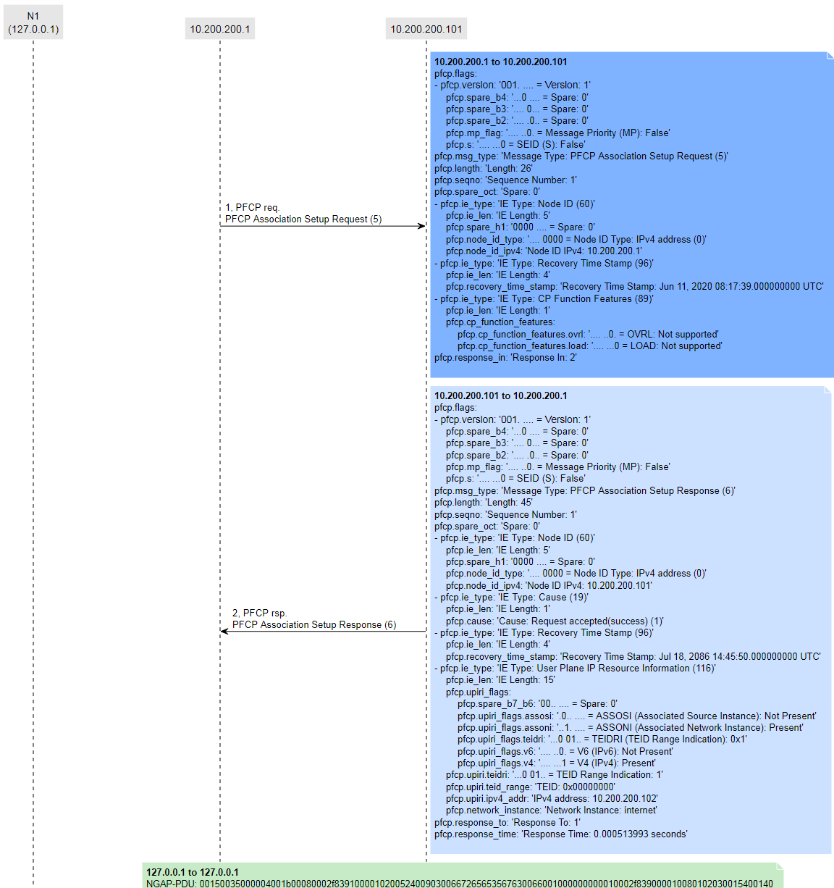

SVG full diagram [here](doc/examples/free5gc_3.4.4.svg)

There seems to be some things missing. That is because the SBI communication will run on varying ports depending on the configuration/deployment. While some ports are used by default, those may not be the ones your deployment are using.

We know from our configuration (or looking at the [Wireshark trace](doc/free5gc.pcap)) that we have SBI communication on ports 29502, 29503, 29504, 29507, 29509, 29518.

Let's try again now running ``python trace_visualizer.py -wireshark 3.2.2 -http2ports "29502,29503,29504,29507,29509,29518" -limit 200 "<path_to_trace>\free5gc.pcap"``
Note: the ``limit`` option overrides the default of maximum 100 messages per output SVG file (else PlantUML's Java runtime often runs out of memory and crashes).

The output looks more like a 5GC trace now:
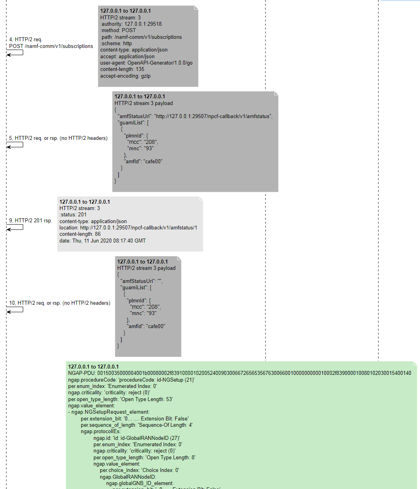

SVG full diagram [here](doc/examples/free5gc_3.2.2_ports.svg)

### Using several Wireshark versions for decoding

While testing a product under heavy development, you may find the case where some NAS messages follow a certain 3GPP release while some other messages follow another.

This may result in no single Wireshark version capable of decoding all messages. i.e., you will always have some ``[Malformed packet]`` payloads shown no matter what version you use.

In order to enable packet decoding using multiple Wireshark versions, use the option ``-wireshark <comma-separated-list-of-wireshark-versions>``.

Example: ``-wireshark "2.9.0,3.1.0"`` will use Wireshark 2.9.0 as baseline dissector and the rest, in this case 3.1.0 as alternative. In case a malformed packet is detected for a given packet, the first non-malformed alternative (in this case 3.1.0, you may specify more) will be used instead.

You also have the option to use the OS-installed Wireshark version by using as version string ``OS``. In this case, the script will not generate a full path for the ``tshark`` executable but rather a call to ``subprocess.run()`` without a full path and only the command itself.

### Omitting HTTP/2 headers

It may happen that you have a lot of additional headers and that they make the generated figures less readable. In this case, you can use the ``ignorehttpheaders`` option.

Example: ``-ignorehttpheaders "x-forwarded-for,x-forwarded-proto,x-envoy-internal,x-request-id,x-istio-attributes,x-b3-traceid,x-b3-spanid,x-b3-sampled"``

Omits each of the HTTP/2 headers in the list from the generated figures.

### Adding additional host labels

It may happen that your system uses a mix of VMs and containers. Or that the mapping for certain IPs is missing. The ``-openstackservers <path to YAML file>`` option allows you to set an additional IP mapping for generating labels.

The syntax of the YAML file is chosen so that it is easy to export the data from OpenStack and directly use it as input without further processing.

Any IP found in the ``fixed`` field will be mapped to the server label. E.g. messages originating from ``192.168.10.2`` and ``192.168.6.19`` IPs will both be shown as originating from the same element, which will be labeled ``Test system running on VM with several IPs``.

Only the labels shown are parsed. Your YAML file may contain additional labels (most probably the case if it is an exported file).

```
servers:
  'Test system running on VM with several IPs':
    interfaces:
      test:
        fixed:     "192.168.10.2"
      n1_n2:
        fixed:     "192.168.3.19"
      n3:
        fixed:     "192.168.5.19"
      n6:
        fixed:     "192.168.6.19"
      oam:
        fixed:     "192.168.1.19"
```

The following example [servers.yaml](doc/examples/servers.yaml) file is used to generate the diagram below:

Run ``python trace_visualizer.py -wireshark 3.2.2 -http2ports "29502,29503,29504,29507,29509,29518" -limit 200 -openstackservers "<path_to_servers.yaml>\servers.yaml" -show_selfmessages True "<path_to_trace>\free5gc.pcap"``

Note: self-messages are typically omitted from the generated diagram. since in this case part of the 5GC is running on localhost, the ``-show_selfmessages True`` option is used to show self-messages.

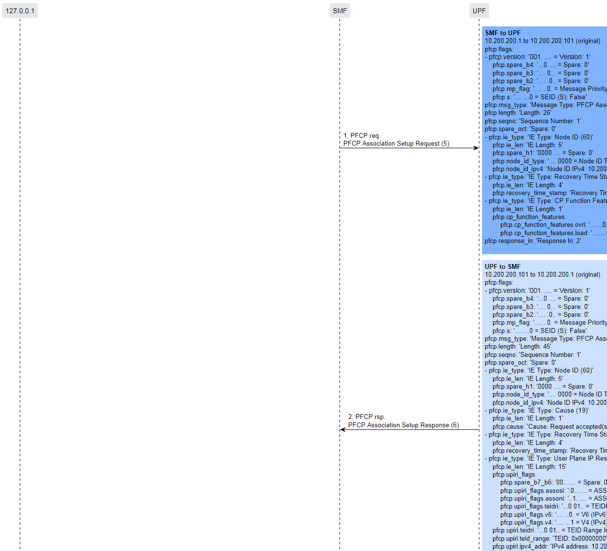

SVG full diagram [here](doc/examples/free5gc_3.2.2_labels.svg)

### Adding timestamps

There is an option to add relative timestamps to the generated diagrams (e.g. to measure processing time).

Just use the ``show_timestamp True`` option, e.g. ``python trace_visualizer.py -wireshark 3.2.2 -http2ports "29502,29503,29504,29507,29509,29518" -limit 200 -openstackservers "<path_to_servers.yaml>\servers.yaml" -show_selfmessages True -show_timestamp True "<path_to_trace>\free5gc.pcap"``

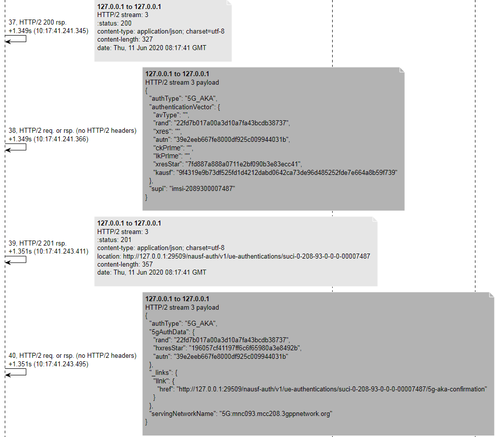

SVG full diagram [here](doc/examples/free5gc_3.2.2_timestamp.svg)

### Showing only certain packets

Do you want to put some pictures in a Wiki or send a diagram to a colleague but there is too much information? There is the option to omit most of the information and also to explicitly show some: ``-simple_diagrams`` and ``-force_show_frames``

As an example, we will generate a diagram showing only a couple of NAS messages for PDU session establishment: frames 15 (registration request), 175 (registration complete) and 228 (PDU session establishment accept).

Just use the ``show_timestamp True`` option, e.g. ``python trace_visualizer.py -wireshark 3.2.2 -http2ports "29502,29503,29504,29507,29509,29518" -limit 200 -openstackservers "<path_to_servers.yaml>\servers.yaml" -show_selfmessages True -show_timestamp True -simple_diagrams True -force_show_frames "15,175,228" "<path_to_trace>\free5gc.pcap"``

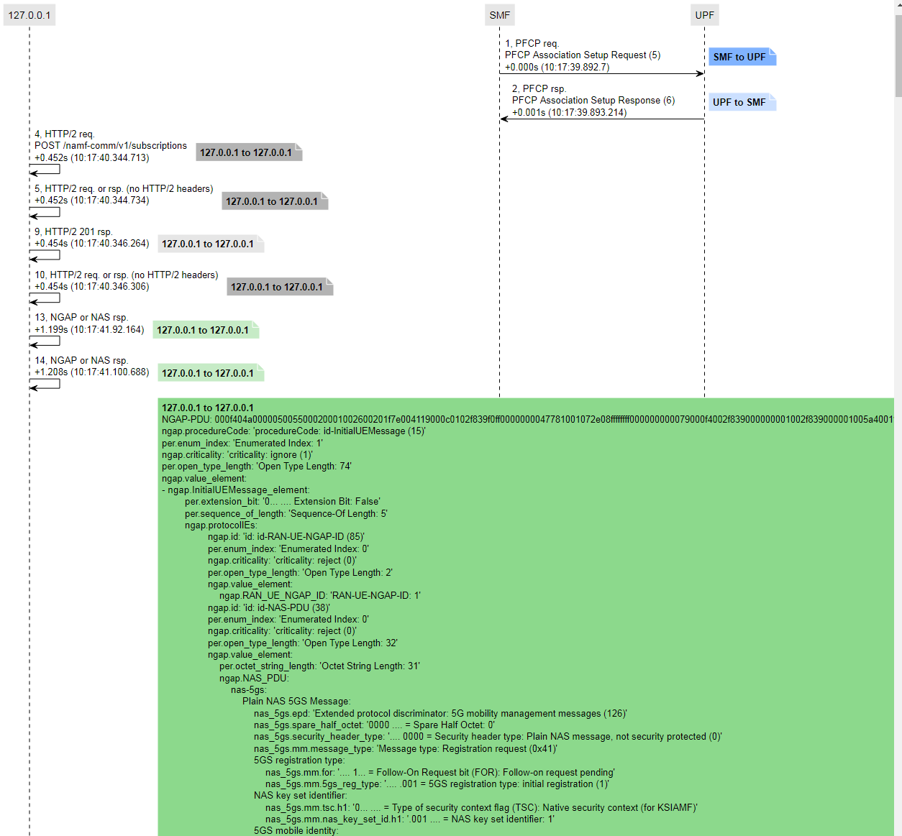

SVG full diagram [here](doc/examples/free5gc_3.2.2_simple.svg)

### Sharing an edited trace

Maybe you have a vendor trace but cannot share a diagram because it contains proprietary information? Or have a real trace but you also cannot share it because it contains personal information? (e.g. real IMSIs).

There are some workaround you can use to get around this.

Let us assume that we want to show the information below but the actual IMSIs (``imsi-2089300007487``) in frames 36, 38 cannot be shown.
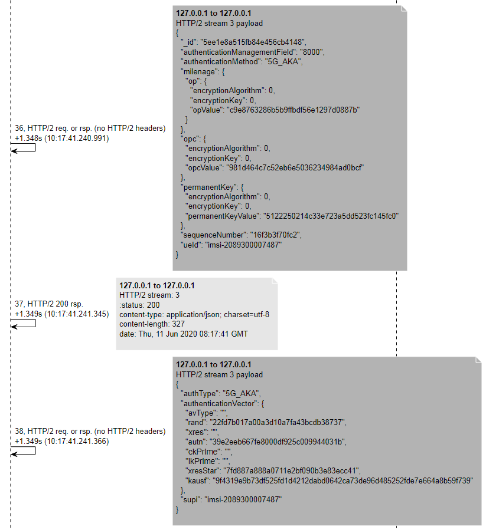

Since this application works on an exported PDML file, you can just edit the generated PDML file and remove/edit from there any information you want. As long as the XML is valid, the output will still be generated.

Just search for ``<field name="num" pos="0" show="36"`` in the PDML file to go to frame 36 and edit it accordingly.

Note that you do not have to edit the parsed HTTP/2 fields but rather the ``http2.data.data`` hex payload. It is cumbersome, but since this application does HTTP/2 frame reconstruction (a data payload can span more than one HTTP/2 frame), it works with the binary payload. Just use a HEX-to-ASCII converter (e.g. [here](https://www.rapidtables.com/convert/number/hex-to-ascii.html)), edit the payload and convert it back to HEX (e.g. [here](https://www.rapidtables.com/convert/number/ascii-to-hex.html)). In this case, we will change the payloads to change ``imsi-2089300007487`` to ``imsi-XXXXXXXXXXXXX (removed)``. You can find the edited trace [here](doc/free5gc_3.2.2_edited.pdml).

The same for frame 38. The output can be seen below


SVG full diagram [here](doc/examples/free5gc_3.2.2_imsi_edited.svg)

Editing headers is simpler. To modify the header shown below,
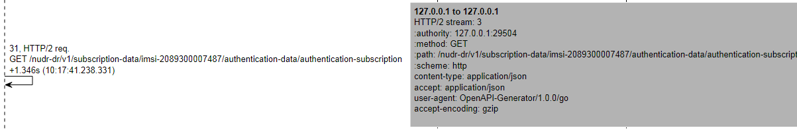

You just need to go to frame 31 and to the ``<field name="http2.header" showname="Header: :path: ``. The application uses the ``show`` value of each header to generate the diagrams (in this case ``<field name="http2.header.value"``). In this case we changed the value to ``show="/nudr-dr/v1/subscription-data/imsi-XXXXXXXXXXXXX/authentication-data/authentication-subscription"``.

The result can be seen below:
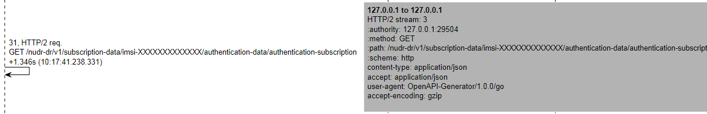

Maybe some editing features will be added in the feature, but will depend on whether that is really needed or not.

### Ordering labels in a specific order

Just use ``-force_order``, e.g. ``-force_order "gNB,AMF,SMF,UDM"``

### Missing HTTP headers and HPACK

A common issue is that a packet capture may have been started after the [HPACK](https://httpwg.org/specs/rfc7541.html) header table has been initialized, which leads to missing header entries in the packet capture.

While not really an issue to be solved here, you may find it useful to know that Wireshark does apparently provide a way to inject HTTP2/GRPC headers via ``uat``.

You can find some information regarding HTTP2/GRPC header injection in the [related feature request](https://gitlab.com/wireshark/wireshark/-/merge_requests/4877) and also [GRPC dissector documentation](https://gitlab.com/wireshark/wireshark/-/wikis/grpc).

If you want to play around with the feature itself, it is available in the GUI also under ``Preferences``->``Protocols``->``HTTP2``, where you can find the tables that can be setup via ``uat``.

### Proprietary protocol traces

For some use cases, the trace may not come from a direct capture, but it may rather be generated by a tool (e.g. an in-built tap in the 5GC software).
In such cases, the protocol stack may not look "normal" (e.g. Ethernet/IP). One such example is shown below (the original trace can be found [here](doc/examples/one_packet.pcapng)):

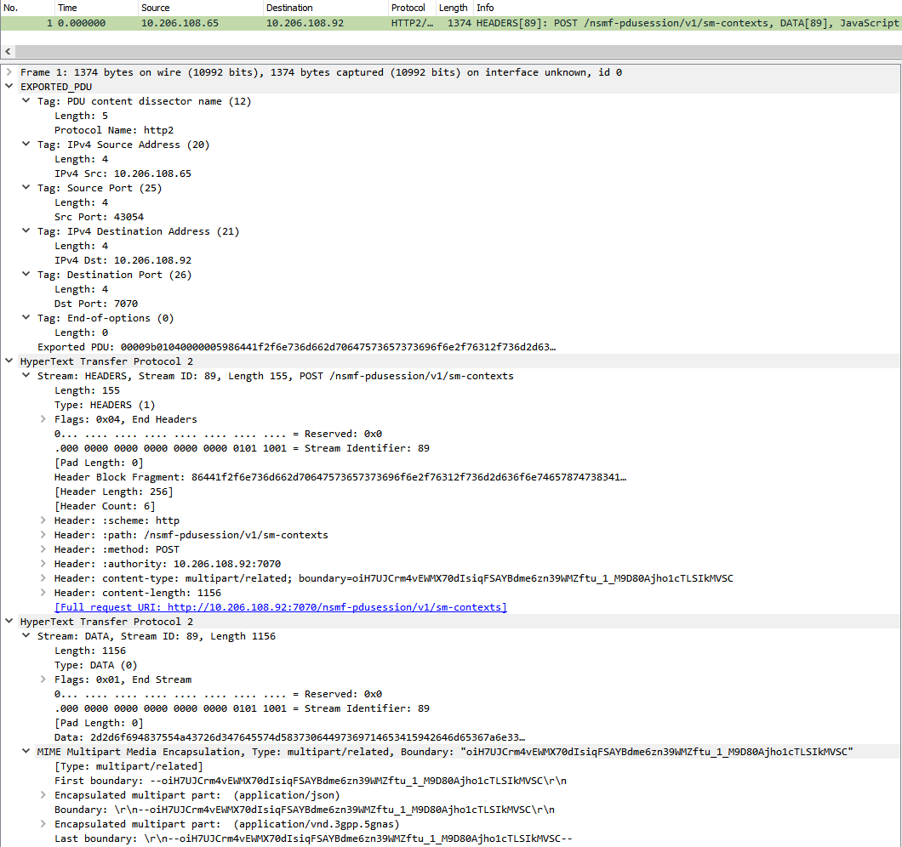.

The actual data with which this script works is the exported [PDML](https://wiki.wireshark.org/PDML) file, for which for this specific protocol (``exported_pdu``) looks as follows:

```
<proto name="exported_pdu" showname="EXPORTED_PDU" size="45" pos="0">
  <field name="exported_pdu.tag" showname="Tag: PDU content dissector name (12)" size="9" pos="0" show="12" value="000c00056874747032">
    <field name="exported_pdu.tag_len" showname="Length: 5" size="2" pos="2" show="5" value="0005"/>
    <field name="exported_pdu.prot_name" showname="Protocol Name: http2" size="5" pos="4" show="http2" value="6874747032"/>
  </field>
  <field name="exported_pdu.tag" showname="Tag: IPv4 Source Address (20)" size="8" pos="9" show="20" value="001400040ace6c41">
    <field name="exported_pdu.tag_len" showname="Length: 4" size="2" pos="11" show="4" value="0004"/>
    <field name="exported_pdu.ipv4_src" showname="IPv4 Src: 10.206.108.65" size="4" pos="13" show="10.206.108.65" value="0ace6c41"/>
    <field name="ip.addr" showname="Source or Destination Address: 10.206.108.65" hide="yes" size="4" pos="13" show="10.206.108.65" value="0ace6c41"/>
    <field name="ip.src" showname="Source Address: 10.206.108.65" hide="yes" size="4" pos="13" show="10.206.108.65" value="0ace6c41"/>
  </field>
  <field name="exported_pdu.tag" showname="Tag: Source Port (25)" size="8" pos="17" show="25" value="001900040000a82e">
    <field name="exported_pdu.tag_len" showname="Length: 4" size="2" pos="19" show="4" value="0004"/>
    <field name="exported_pdu.src_port" showname="Src Port: 43054" size="4" pos="21" show="43054" value="0000a82e"/>
  </field>
  <field name="exported_pdu.tag" showname="Tag: IPv4 Destination Address (21)" size="8" pos="25" show="21" value="001500040ace6c5c">
    <field name="exported_pdu.tag_len" showname="Length: 4" size="2" pos="27" show="4" value="0004"/>
    <field name="exported_pdu.ipv4_dst" showname="IPv4 Dst: 10.206.108.92" size="4" pos="29" show="10.206.108.92" value="0ace6c5c"/>
    <field name="ip.addr" showname="Source or Destination Address: 10.206.108.92" hide="yes" size="4" pos="29" show="10.206.108.92" value="0ace6c5c"/>
    <field name="ip.dst" showname="Destination Address: 10.206.108.92" hide="yes" size="4" pos="29" show="10.206.108.92" value="0ace6c5c"/>
  </field>
  <field name="exported_pdu.tag" showname="Tag: Destination Port (26)" size="8" pos="33" show="26" value="001a000400001b9e">
    <field name="exported_pdu.tag_len" showname="Length: 4" size="2" pos="35" show="4" value="0004"/>
    <field name="exported_pdu.dst_port" showname="Dst Port: 7070" size="4" pos="37" show="7070" value="00001b9e"/>
  </field>
  [...]
</proto>
```

For such cases, the following options can be used:
* ``custom_packet_filter``: Originally, this script only considers frames in the capture file that contain IPv4 or IPv6 protocols. This is done by filtering out packets not matching the ``packet.findall("proto[@name='ip']")`` or ``packet.findall("proto[@name='ipv6']")`` [XPath](https://lxml.de/xpathxslt.html) expressions. The string you set in this parameter will additionally use the ``proto[@name='{custom_packet_filter}']`` filter, e.g. ``exported_pdu``.
* ``custom_ip_src``: An XPath expression pointing to an element from which the source IP address can be extracted, e.g. ``field[@name='exported_pdu.ipv4_src']``
* ``custom_ip_src_attribute``: While ``custom_ip_src`` selects the element from which the IP source address can be extracted, ``custom_ip_src_attribute`` points to the attribute within the element containing the actual text you want to use as label, e.g. ``show`` results in ``10.206.108.65`` being shown and ``showname`` in ``IPv4 Src: 10.206.108.65``
* ``custom_ip_dst``: Sames as with ``custom_ip_src``, e.g. ``field[@name='exported_pdu.ipv4_dst']``
* ``custom_ip_dst_attribute``: Same as with ``custom_ip_src_attribute``, e.g. ``show``

For this specific example, the following call can be used:

``
python trace_visualizer.py -wireshark 4.0.5 -limit 70 -show_timestamp True -custom_packet_filter "exported_pdu" -custom_ip_src "field[@name='exported_pdu.ipv4_src']" -custom_ip_dst "field[@name='exported_pdu.ipv4_dst']" -custom_ip_src_attribute "show" -custom_ip_dst_attribute "show" "<path>\one_packet.pcapng"
``

Which generates the following output:
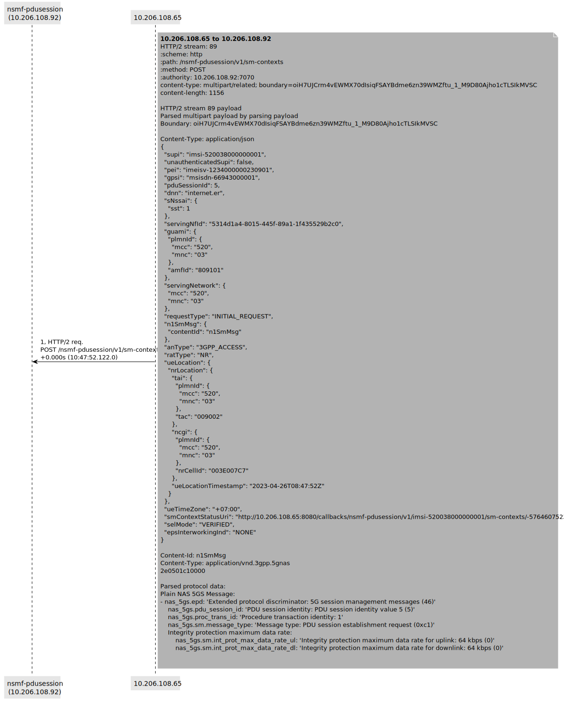

## Notes

There may be some issues with HTTP/2 frame fragment reconstruction, so drop me a line if you find some issues.

For MIME Multipart messages that are not JSON, the diagrams show the binary content in hex form. In some cases, Wireshark can show NAS content within a MIME Multipart, which is not shown here.
It was a conscious decision to do it like this for now. If I find time for it, I may add some code to take (if existing) the parsed NAS message :) It may be useful for cases where the ``n1n2`` message is encrypted and the SBI trace is not.
