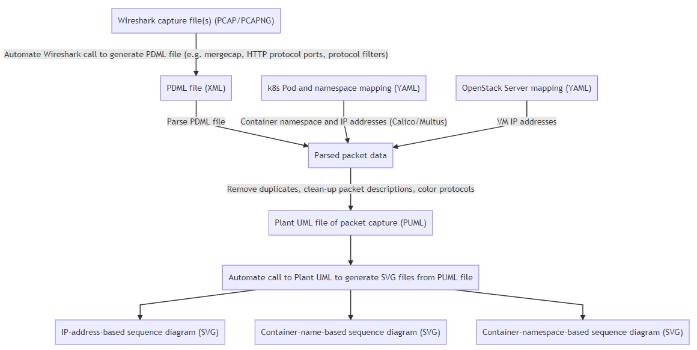
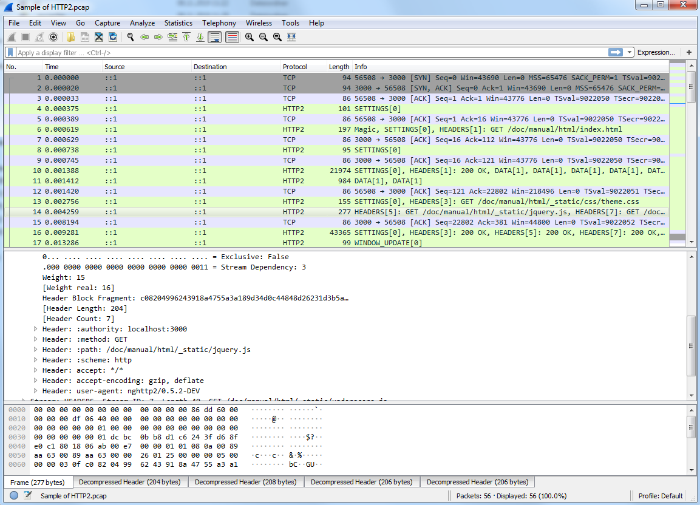

# 5G Trace Visualizer

* Table of contents
  * [Summary](#summary)
  * [Requirements](#requirements)
  * [Application structure](#application-structure)
  * [Examples](#examples)
    * [Help](#help)
    * [HTTP/2 trace](#http2-trace)
    * [Adding pod data](#adding-pod-data)
    * [Merging capture files](#merging-capture-files)
    * [Specifying HTTP/2 ports](#specifying-http2-ports)
    * [Using several Wireshark versions for decoding](#using-several-wireshark-versions-for-decoding)
    * [Omitting HTTP/2 headers](#omitting-http2-headers)

# Summary

This set of Python scripts allow you to convert ``pcap``, ``pcapng`` or ``pdml`` 5G protocol traces ([Wireshark](https://www.wireshark.org/), [tcpdump](https://www.tcpdump.org/), ...) into SVG sequence diagrams.

It was born from the need to automatically convert 5G traces into something readable given that we needed to account for:
* Mix of HTTP/2, 5G-NAS and PFCP protocols
* Sequence details are quite tiring to check in the Wireshark GUI
* Specific versions of Wireshark may be needed to decode specific versions of (e.g.) 5G-NAS
* The shift to containers results into traces with multiple IP addresses that are dynamically allocated by k8s
* Mapping of IPs to container names in the deployment, including [Calico](https://www.projectcalico.org/) and [Multus](https://github.com/intel/multus-cni) interfaces
* In some cases, what is of interest are the exchanges between namespaces and not between containers
* Mapping of IPs to VM names in the deployment
* Different coloring of the different 5G protocols (NAS, HTTP/2, PFCP), as well as differentiating between requests and responses where possible

We could not find a commercial tool doing exactly what we needed. While [PlantUML](http://plantuml.com/) can generate nice diagrams, doing those manually requires too much time. So we resorted to putting together this script.

## Requirements
* You need to have Java installed (executing the ``java`` command must launch Java). this is required because PlantUML runs on Java
* ``plantuml.jar`` must be placed in the base directory (see [``place plantuml.jar here.txt``](place plantuml.jar here.txt)). This application was tested with the 2019.11 version (Apache Software License Version) of ``plantuml.jar``. You can find it [here](http://sourceforge.net/projects/plantuml/files/plantuml-jar-asl-1.2019.12.zip/download).
* Wireshark portable of the desired versions placed in the ``/wireshark`` folder. See [instructions in folder](/wireshark/Readme.md).

## Application structure

The figure below summarizes what this small application does ([SVG](doc/summary.svg), [PNG](doc/summary.png), [Mermaid](doc/summary.mermaid))

## Examples

### Help

Run ``python trace_visualizer.py --help`` for a list of all available parameters, default values and other things you may need.

### HTTP/2 trace

While at some point it would be nice to have real 5G traces as examples, it is currently not possible to post those. They typically contain intra-NF communication and/or proprietary protocol specifics. So they are not easy to come by.

As alternative, we will use the sample HTTP/2 capture from the [Wireshark wiki](https://wiki.wireshark.org/HTTP2) and show you how to use the application with the [``http2-h2c.pcap``](https://wiki.wireshark.org/HTTP2?action=AttachFile&do=get&target=http2-h2c.pcap) file

As shown in Wireshark, the capture should look as shown below:

The following command converts the Wireshark trace into the SVG diagram shown below give that ``plantuml.jar`` and the ``WiresharkPortable_3.1.0`` folder are placed where they should:

``python trace_visualizer.py -wireshark "3.1.0" "<file path>\Sample of HTTP2.pcap"``

([Link to SVG file](doc/Sample%20of%20HTTP2.svg))

### Adding pod data

Just use the ``-pods`` optional parameter and as parameter use the output of ``kubectl get pods --all-namespaces -o yaml``

e.g. ``python trace_visualizer.py -pods "<path to YAML file>" -wireshark "3.1.0" "<file path>\Sample of HTTP2.pcap"``

The script will now output a ``pod`` and ``namespace`` version of the SVGs, where the IPs will be replaced with pod names or namespace names respectively.

This allows you to filter out intra-pod messages and intra-namespace messages to have a clearer view of the messaging.

### Merging capture files

You may also input not a single capture as input, but a comma-separated list of capture files. In this case, the script will automatically call [``mergecap``](https://www.wireshark.org/docs/man-pages/mergecap.html) and merge the given capture files. This can be useful if you have capture files from e.g. several k8s worker nodes.

``python trace_visualizer.py -wireshark "3.1.0" "<file path>\Sample of HTTP2.pcap,<file path>\Sample of another file.pcap"``

The same Wireshark version will be used for all of the files for dissection.

Do note that this will only give you a useful output if you time-synchronized the hosts where the captures were taken (nothing to do with this script). Else, you will merge time-shifted captures.

### Specifying HTTP/2 ports

Just use the ``-http2ports`` ports parameters. E.g. ``-http2ports "3000,80"`` tells Wireshark to decode communication on those ports as HTTP/2. Useful if you are using non-standard ports for your communication.

### Using several Wireshark versions for decoding

While testing a product under heavy development, you may find the case where some NAS messages follow a certain 3GPP release while some other messages follow another.

This may result in no single Wireshark version capable of decoding all messages. i.e., you will always have some ``[Malformed packet]`` payloads shown no matter what version you use.

In order to enable packet decoding using multiple Wireshark versions, use the option ``-wireshark <comma-separated-list-of-wireshark-versions>``.

Example: ``-wireshark "2.9.0,3.1.0"`` will use Wireshark 2.9.0 as baseline dissector and the rest, in this case 3.1.0 as alternative. In case a malformed packet is detected for a given packet, the first non-malformed alternative (in this case 3.1.0, you may specify more) will be used instead.

### Omitting HTTP/2 headers

It may happen that you have a lot of additional headers and that they make the generated figures less readable. In this case, you can use the ``ignorehttpheaders`` option.

Example: ``-ignorehttpheaders "x-forwarded-for,x-forwarded-proto,x-envoy-internal,x-request-id,x-istio-attributes,x-b3-traceid,x-b3-spanid,x-b3-sampled"``

Omits each of the HTTP/2 headers in the list from the generated figures.

## Notes

There may be some issues with HTTP/2 frame fragment reconstruction, so drop me a line if you find some issues
